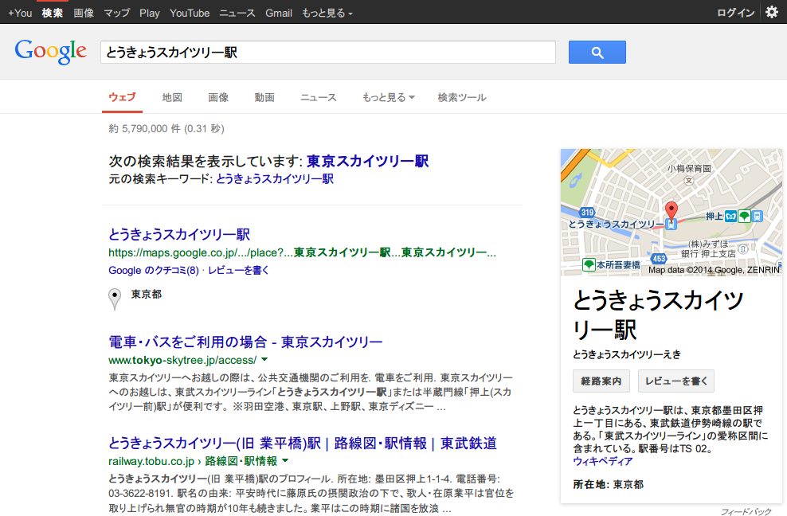

Google Autocorrect Blocker
==========================

Googleの検索語句自動訂正を無効化するGreasemonkey/Tampermonkey用ユーザースクリプト

## 概要

Google Autocorrect Blocker はGoogleの検索語句自動訂正を無効化するGreasemonkey/Tampermonkey用ユーザースクリプトです。

Google検索の際、次のように検索語句の自動訂正が行われることがあります。

次の検索結果を表示しています: _東京スカイツリー駅_

元の検索キーワード: とうきょうスカイツリー駅

本スクリプトは、このような検索語句の自動訂正により表示される「元の検索キーワード: \*」のリンク (`a.spell_orig`) の存在を検知すると、「元の検索キーワード: \*」のリンク先にリダイレクトします。

## 注意事項
インスタント検索がオンの状態だと正常に動作しない可能性があります。このスクリプトを使用する際にはインスタント検索をオフにすることを強く推奨します。

## 作者
[たかだか。(TakaDaka.)](https://twitter.com/djtkdk_086969)