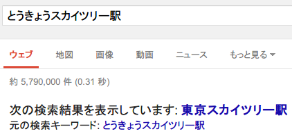

Google Autocorrect Blocker
==========================

User script for Greasemonkey / Tampermonkey which disables Google Search Autocorrect

## Summary

[日本語版のREADME.mdはこちら](README.ja.md)

Google Autocorrect Blocker is a user script for Greasemonkey / Tampermonkey which disables Google Search Autocorrect.

The Google Search sometimes auto-corrects your search query like:

Showing results for: _localhost_

Search instead for: localhsot

This script detects search query autocorrect and redirects to the results for your original search query by detecting the "Search instead for \*" link (`a.spell_orig`)

## Disclaimer
This script might not work if the Instant Search feature is enabled. It is strongly recommended that you disable the Instant Search feature while using this script.

## Author
[たかだか。(TakaDaka.)](https://twitter.com/djtkdk_086969)